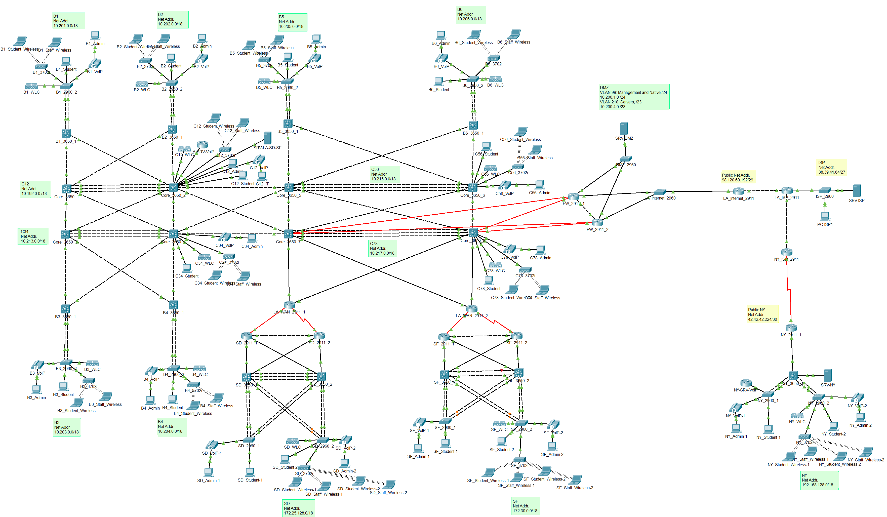

# Enterprise Network Design & Configuration (CCNA-Level Final Project)

**Tool Used:** Cisco Packet Tracer  
**Scope:** Multi-site campus topology with full Layer 2/3 design  
**Skills Demonstrated:** VLAN design, VTP domains, routing (EIGRP/static), HSRP, EtherChannel (LACP), DHCP, NAT, STP, VoIP, wireless, failover routing

## Project Overview
This project simulates the deployment of an enterprise-grade network infrastructure spanning four major office locations: Los Angeles (HQ), San Diego, San Francisco, and New York. The environment includes core switching, router configurations, wireless, voice, and security integrations using Cisco technologies. The goal was to apply CCNA-level knowledge to create a scalable, redundant, and secure network using best practices.

    

## Network Design Breakdown

### Sites and Addressing
Each site has its own subnetting scheme and routing domain:

- **LA Office (HQ):** 10.192.0.0/11
- **San Diego Office:** 172.25.128.0/18
- **San Francisco Office:** 172.30.0.0/18
- **New York Office:** 192.168.128.0/18
- **Point-to-point (L3) links:** /30 to conserve IP space

### VLANs and VTP Domains
All core switches and access switches are assigned VLANs based on their role in the network. VLANs were grouped by purpose:

| VLAN | Purpose | Subnet Size |
|------|---------|-------------|
| 99   | Management & Native VLAN | /24 |
| 25   | Wireless Controllers & AP | /24 |
| 26   | VoIP Server | /24 |
| 210  | Servers | /23 |
| 212  | IT Department | /23 |
| 214  | Admin PCs | /23 |
| 216  | IP Phones | /23 |
| 220  | Student PCs | /21 |
| 222  | Wireless Staff SSID | /22 |
| 244  | Wireless Student SSID | /21 |

Each office operates under a separate VTP domain to maintain independent VLAN propagation and avoid accidental overwrites (Example: CORE_12, SD, SF, NY).

### Redundancy & Layer 3 Routing
To ensure high availability:

- **HSRP (Hot Standby Router Protocol)** was implemented for each VLAN across core switch pairs. Each VLAN had a virtual default gateway, with one switch active and one standby.
- **Inter-VLAN routing** was configured on all Layer 3 capable 3650 switches.
- **EIGRP (IPv4)** was deployed in LA, SD, and SF for fast convergence and route summarization.
- **Static routing** was used in the NY office and edge routers to simulate ISP/public connectivity.
- **Floating static routes** were set up in firewalls to simulate failover between dual ISPs.

### Switching Technologies
- **EtherChannel (LACP)** was configured over trunk links for link redundancy and load balancing.
- **Spanning Tree Protocol (STP):**
  - Root Primary and Secondary were manually set for each VLAN.
  - Ensured a loop-free topology with deterministic failover.

### Security & Internet Failover
- **Dual Cisco ISR 2911 routers** were configured to simulate internet failover.
- Primary traffic flows through **FW_2911_1**, but upon failure, routing fails over to **FW_2911_2** via a floating static route.
- **NAT** was configured for outbound traffic from internal subnets to simulate internet access.

### Wireless and VoIP Integration
- Each site had a dedicated **Wireless LAN Controller (WLC)** and **Access Point (AP)**.
- Wireless networks included:
  - **staff-xx** (WPA2)
  - **students-xx**
- **VoIP:**
  - Cisco **7960 IP Phones** with DHCP-supplied addresses
  - Cisco **2811 router** functioning as a VoIP server
  - Directory numbers: **West = 1000–1999**, **East = 2000–2999**

### DHCP & End Device Setup
DHCP scopes were created for:
- **VoIP Phones**
- **Students**
- **Wireless clients**

VLANs were populated per spec:
- 1 PC in **IT**, **Admins**, and **Student VLANs**
- 1 IP phone in the **VoIP VLAN**
- Wireless laptops for both **SSIDs**
- 1 server in each **Server VLAN**

### Technologies Applied

| Area         | Technologies / Concepts Used |
|--------------|------------------------------|
| VLAN & Trunking | switchport trunk, VTP, native vlan, VLAN database |
| Redundancy   | HSRP, STP, EtherChannel (LACP) |
| Routing      | EIGRP, static routes, default route, floating routes |
| Security     | NAT, Failover with floating static routes |
| Wireless     | SSID, WLC, AP, DHCP, SSID segmentation |
| Voice        | Cisco IP Phones, VoIP, DHCP Option 150 |
| Addressing   | CIDR, /30, /24, /23, /22, /21 subnets |

### Outcome
This final project showcases my ability to design, implement, and troubleshoot a full-scale enterprise network architecture using Cisco technologies. Every component was configured manually without automation tools to reinforce a deep understanding of core networking concepts. The finished network was fully operational, fault-tolerant, and aligned with real-world enterprise best practices.

